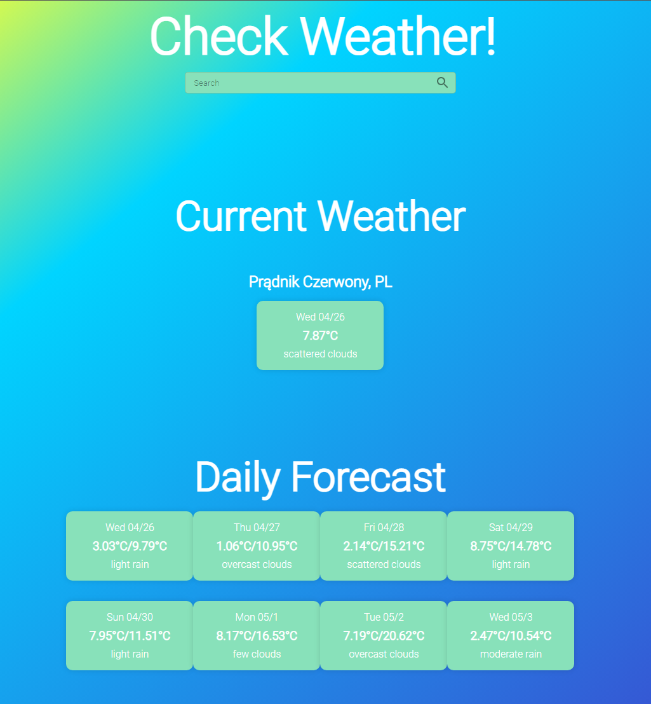

# ReactWeatherApp

It's the simple application where you can check weather and forecast for the whole week.
You can enter the city where you want to check the weather, or click on "Check weather" and check the weather in your location.



## How to use it?

First of all you need to download or clone the repository and then install the dependencies via:

```bash
npm i
```

or

```bash
npm install
```

Next thing to do is get your private key from [OpenWeatherMap API](https://openweathermap.org/api) by logging in on their website.
When you will get one, you need to create **.env** file and fill it with

```python
REACT_APP_WEATHER_API_KEY=here_paste_your_OWM_API_key
```

Then build the application by typing

```bash
npm dev build
```

and you can launch it via

```bash
npm start
```

it should automaticly open your browser.

## Tech Stack

- TypeScript
- React.js
- React Router
- Styled components
- OpenWeatherMap API
- HTML
- Webpack
